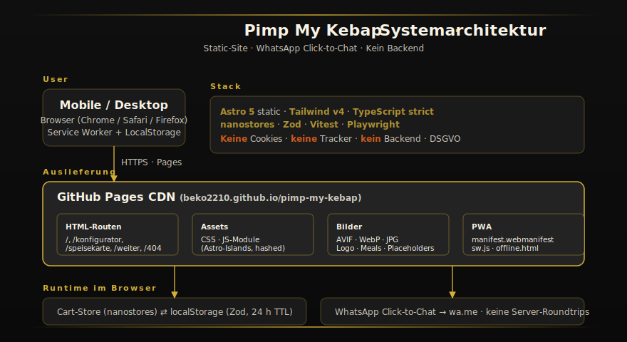
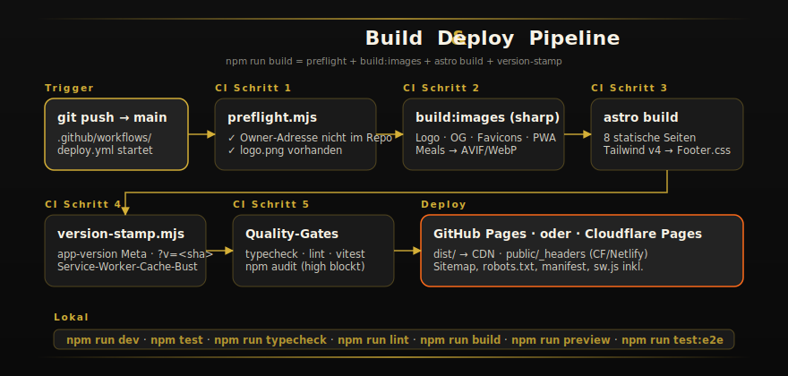

# Pimp My Kebap — Bestell-Website

> **Marktplatz 18 · 71691 Freiberg am Neckar** ·
> Statische Mobile-First-Site, Bestellung über **WhatsApp Click-to-Chat**.
> Kein Backend. Kein Tracker. Keine Cookies. DSGVO-konform.

[Live](https://beko2210.github.io/pimp-my-kebap/) ·
[Übergabe-Checkliste](./TODO_OWNER.md) ·
[Security-Policy](./SECURITY.md) ·
[Projekt-Brief für KI-Sessions](./CLAUDE.md)

---

## Systemarchitektur



## Bestell-Flow


## Build &amp; Deploy



---

## Setup

```bash
npm install
cp .env.example .env       # PUBLIC_RESTAURANT_WHATSAPP setzen
npm run dev                # http://localhost:4321
```

### ENV-Variablen

| Variable | Pflicht | Beschreibung |
|---|---|---|
| `PUBLIC_RESTAURANT_WHATSAPP` | ja | E.164 ohne `+` (z. B. `491742116095`) |
| `PUBLIC_SITE_URL` | empfohlen | Canonical-URL für Sitemap, OG, JSON-LD |

Alle `PUBLIC_*`-Variablen werden in den Build eingebacken — explizit öffentlich, **keine Secrets**.

## Scripts

| Befehl | Zweck |
|---|---|
| `npm run dev` | Astro Dev-Server |
| `npm run build` | Production-Build (preflight + image-pipeline + astro + version-stamp) |
| `npm run preview` | Statisches Preview gegen `dist/` |
| `npm test` | Unit-Tests (Vitest) |
| `npm run test:coverage` | mit Coverage-Report |
| `npm run test:e2e` | Playwright (Mobile + Desktop) |
| `npm run lint` | ESLint |
| `npm run typecheck` | `astro check` |
| `npm run audit` | `npm audit`, bricht bei high/critical |

## Architektur-Map

```
src/
├── data/           Single Source of Truth (menu, drinks, brand, delivery, allergens, …)
├── lib/            Reine Logik (pricing, whatsapp, time, holidays, validation, cart)
├── components/     Astro-Komponenten + colocated *.client.ts
│   ├── Configurator/    3-Schritt-Wizard Kebap
│   ├── PizzaConfigurator/
│   ├── Cart/            Drawer + sticky Bottom-Bar
│   └── MenuSection/     Speisekarten-Sektionen + Filter
├── layouts/Base.astro   Globales Layout (CSP, JSON-LD, Fonts, SW-Boot)
├── pages/               index, konfigurator, pimp-my-pizza, speisekarte,
│                        weiter, impressum, datenschutz, 404
└── styles/              tokens.css + global.css
```

## Sicherheit (Highlights)

- Strikte CSP (`script-src 'self'`, kein `eval`, kein inline-JS außer `application/ld+json`)
- HSTS · `X-Frame-Options=DENY` (nur über echte HTTP-Header — siehe `public/_headers`)
- `Permissions-Policy` lockdown
- Notes-Input-Whitelist + 280-Zeichen-Limit
- WhatsApp-Send Throttle (1× / 5 s)
- `localStorage` per Zod-Schema validiert, Versions-Schlüssel + 24 h TTL
- `scripts/preflight.mjs` blockt Build, falls die Wohnanschrift der Inhaberin im Repo auftaucht

Volle Beschreibung: [`SECURITY.md`](./SECURITY.md).

## Deploy

### GitHub Pages (Default)
Push auf `main` triggert `.github/workflows/deploy.yml` → `dist/` als Pages-Artefakt.
Einmalig in **Settings → Pages → Source** auf **GitHub Actions** stellen.

> ⚠️ GitHub Pages liest `public/_headers` **nicht**. Für `frame-ancestors`-Schutz und
> volle HSTS auf eigenem HTTP-Header-Niveau auf Cloudflare/Netlify wechseln.

### Cloudflare Pages (alternativ)
`wrangler.toml` ist vorbereitet. Build-Command `npm run build`, Output `dist`.
`public/_headers` wird automatisch als HTTP-Header gelesen.

## Aktualisierungspfade

| Was ändern? | Wo? |
|---|---|
| Speisekarte / Preise | `src/data/menu.ts` |
| Aktionspreise (Mo/Di/Mi/Sa) | `promoPriceMap` der Items in `menu.ts` |
| Liefergebühren / Zonen | `src/data/delivery.ts` |
| Öffnungszeiten / Feiertagsregel | `src/data/brand.ts` + `src/lib/holidays.ts` |
| Konfigurator-Bausteine | `src/data/configurator.ts`, `breads.ts`, `sauces.ts`, `ingredients.ts` |
| WhatsApp-Nummer | `.env` bzw. CI-ENV |
| Logo / OG-Image | `public/brand/logo.png` (Source) — Build erzeugt AVIF/WebP/Favicon/PWA |

## Tests

`npm test` — Unit-Tests für `lib/`: pricing, whatsapp, time, holidays, validation, format.
Coverage-Schwelle **≥ 85 %** für `src/lib/`. CI bricht bei Verletzung ab.

`npm run test:e2e` — Playwright-Suite (iPhone 13, Pixel 7, Desktop) für die zentralen
Flows (Konfigurator, Speisekarte, Cart, Hamburger).

## Übergabe

Inhaberin-Checkliste: [`TODO_OWNER.md`](./TODO_OWNER.md).

## Lizenz

- **Code**: MIT
- **Logo**: © Pimp My Kebap / Inhaberin Fatma Tasocak-Savci. Alle Rechte vorbehalten.
- **Schriften**: Inter und Playfair Display, jeweils SIL OFL 1.1 (selbst-gehostet in `public/fonts/`).
